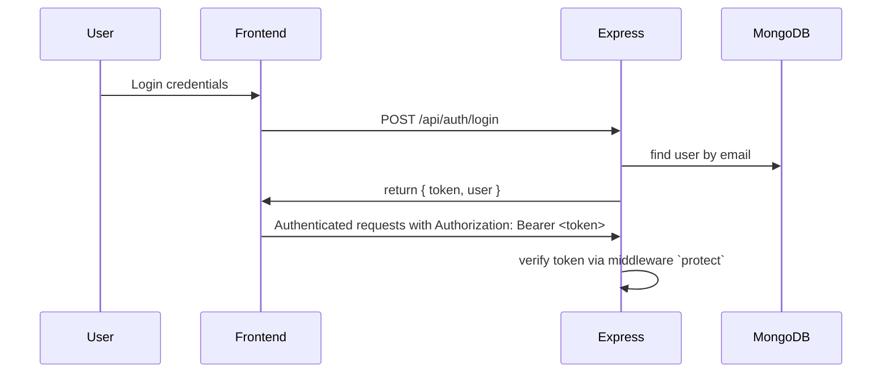
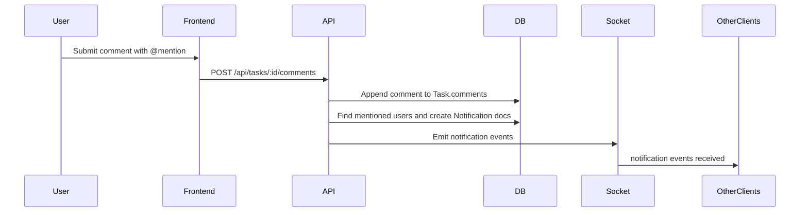
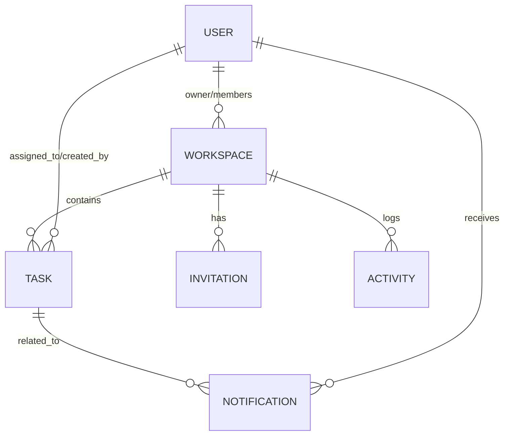
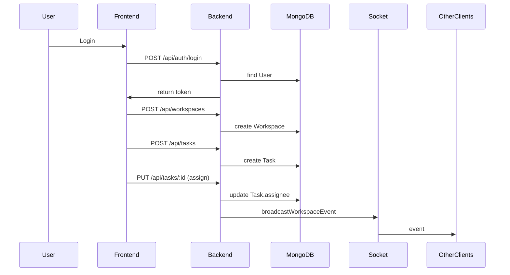
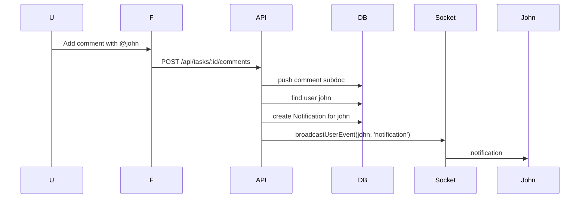

# Collaborative Kanban Board — Project Documentation

Project: Collaborative Kanban Board
Candidate: Farheen Banu S D
Role: Full Stack Developer Intern
Company: Cafy Careers

---

[Cover Page Placeholder — Add Company Logo Here]

Collaborative_Kanban_Board_Project_Documentation.pdf

---

Table of Contents

1. Executive Summary
2. Technology Stack
3. System Architecture
4. Project Features
5. Database Design
6. Folder Structure
7. REST API Documentation
8. Security Implementation
9. Project Workflow
10. Deployment
11. Testing
12. Project Challenges
13. Performance Optimization
14. Future Enhancements
15. Conclusion
16. Appendices

---

**Important:** This document is built from the project source present in the workspace. It includes only implemented features, routes, models and files.

---

## 1. Executive Summary

Project overview

The Collaborative Kanban Board is a full-stack web application that enables teams to manage tasks collaboratively in workspace contexts. The system provides authenticated access, workspace creation and membership, task creation and management (Kanban style), comments with @mentions, attachments, notifications, and a simple dashboard for workspace statistics. The frontend is a React SPA (Vite), and the backend is a Node.js + Express API with MongoDB for persistence.

Business problem

Teams and small projects often need a central, visual task board that is lightweight and collaborative. Communication scattering across chat and email makes coordination harder; the Kanban Board centralizes tasks, comments, and attachments.

Solution

The application offers workspace-organized Kanban boards, task CRUD operations, inline comments with mention notifications, attachments, real-time notification delivery (Socket.IO), and role-aware workspace management.

Objectives

- Implement secure user authentication.
- Provide workspace creation, joining, and role assignment.
- CRUD operations for tasks with statuses, priorities, labels, due dates, and assignees.
- Commenting with mention parsing and notifications.
- Basic dashboard aggregates.
- File attachments with server storage and API access.
- Real-time notification events using Socket.IO.

Scope

The codebase implements the above features. Features not present (e.g., cloud object storage for attachments, external OAuth providers) are documented in Future Enhancements.

Expected users

Small to medium-sized teams, project managers, and individual contributors wanting a lightweight Kanban workflow.

Key achievements

- End-to-end implementation of a Kanban workflow, including comments, mentions, attachments, and notifications.
- Server-side validation, authentication, and permission checks.
- Real-time notifications via Socket.IO to enhance UX.

---

## 2. Technology Stack

| Category | Technology | Purpose | Why chosen / Advantages |
|---|---|---|---|
| Frontend | React + Vite | SPA and development tooling | Fast dev builds, modern ecosystem |
| Styling | Tailwind CSS (project uses utility CSS) | UI styling | Utility-first rapid styling (project files show Tailwind classes) |
| Routing | React Router | Client-side navigation | Standard for React SPAs |
| HTTP | Axios | API client | Interceptors for auth & errors implemented in `frontend/src/services/api.js` |
| Backend | Node.js, Express | REST API server | Lightweight, flexible middleware pattern |
| Database | MongoDB (Mongoose) | Document persistence | Flexible schema for tasks with embedded arrays; indexes used in Task model |
| Auth | JSON Web Tokens (jsonwebtoken), bcryptjs | Stateless authentication, secure password hashing | Industry standard for token-based APIs |
| Real-time | Socket.IO | Notification and workspace event delivery | Simple event-based communication for low-latency updates |
| Uploads | Multer | File upload processing | Disk-based storage in dev; `upload.single('attachment')` used in task routes |
| Email | Nodemailer | Invitation emails | Optional when SMTP env vars configured; code handles missing creds gracefully |
| Validation | express-validator | Request validation | Declarative validators in route definitions |
| Security | helmet, cors, express-rate-limit | Hardening, CORS, rate limiting | Standard middleware to secure APIs |
| API Docs | swagger-jsdoc, swagger-ui-express | OpenAPI generation and UI | Spec generated from code and served at `/api-docs` |
| Dev Tools | morgan, nodemon (dev), jest, supertest (dev) | Logging, local development, test frameworks | Standard tooling for Node apps |
| Hosting | Render (backend), Vercel (frontend) | Deployment platforms used | Simple continuous deployment and hosting for frontend/backen

For each technology above, the codebase contains imports and configuration files (see `backend/src/config` and `frontend` files).

---

## 3. System Architecture

Overall architecture

A single-page React frontend communicates with an Express REST API prefixed with `/api`. The backend persists data in MongoDB and initializes Socket.IO on the same HTTP server to deliver real-time events. Attachments are stored on the server's filesystem (development). The server exposes Swagger UI for API documentation at `/api-docs`.

Frontend architecture

- `frontend/src/main.jsx` and `frontend/src/App.jsx` bootstrap the React app and define top-level routes.
- Pages in `frontend/src/pages/` represent route-level views: `Dashboard`, `KanbanBoard`, `Login`, `Register`, `Profile`, `WorkspaceList`, `WorkspaceSettings`, `AcceptInvitation`.
- Shared components: `Navbar.jsx`, `Sidebar.jsx`, `ProtectedRoute.jsx`.
- Contexts: `AuthContext.jsx` (authentication), `ThemeContext.jsx` (theme).
- Services: `frontend/src/services/api.js` (axios wrapper), `frontend/src/services/socket.js` (Socket.IO client creator).

Backend architecture

- Express app composed in `backend/src/app.js` with middleware for logging, security, CORS, JSON parsing, and rate limiting. Routes are mounted under `/api` from `backend/src/routes`.
- `backend/src/server.js` starts the HTTP server, connects to MongoDB, and initializes Socket.IO via `initSocketServer` in `backend/src/utils/socketServer.js`.
- Controllers (`backend/src/controllers`) implement endpoints. Services in `backend/src/services` provide domain logic (workspace & dashboard). Models in `backend/src/models` represent persistence.

MVC pattern

- Model: Mongoose models (`User`, `Workspace`, `Task`, `Notification`, `Invitation`, `Activity`).
- View: React pages/components (frontend). The backend provides JSON; frontend renders UI.
- Controller: Express route handlers in `backend/src/controllers`.

Request flow (simplified)

1. User performs action in UI (e.g., create task).  
2. Frontend calls REST endpoint (`POST /api/tasks`).  
3. Backend `protect` middleware validates JWT and loads `req.user`.  
4. Controller validates request, calls services/models to persist data.  
5. Controller creates any necessary notifications and emits Socket.IO events.  
6. Frontend receives success response and updates UI; other clients receive Socket.IO events and update accordingly.

Authentication flow

- Users register and login via `/api/auth/register` and `/api/auth/login`.  
- Login returns a JWT; frontend stores token in localStorage and attaches `Authorization: Bearer <token>` to axios requests.  
- Socket.IO connections attach the same token in `auth` handshake; server verifies token and places socket in user and workspace rooms.

Database flow

- MongoDB stores documents in collections: `users`, `workspaces`, `tasks`, `notifications`, `invitations`, `activities`.  
- Tasks embed `comments` and `attachments` as subdocuments; indexes exist on `Task` for workspace/status and workspace/assignee.

Real-time notification flow

- Mention detection in `createTaskComment` identifies normalized mentions and looks up `User` documents.  
- For each mentioned user, a `Notification` document is created.  
- If `emitRealtime` is true, `notificationController.createNotification` uses `broadcastUserEvent` to emit `'notification'` to user-specific socket room.

### Mermaid diagrams

Overall architecture:

```mermaid
flowchart LR
  Browser -->|HTTPS REST| API[Express API (/api)]
  Browser -->|Socket.IO| Socket[Socket.IO]
  API -->|reads/writes| MongoDB[(MongoDB)]
  API -->|stores| Uploads[uploads/]
  API -->|sends| Email[SMTP (optional)]
  Socket --> Browser
```

Authentication flow:



Request flow (comment creation):



---

## 4. Project Features

**Note:** This section documents only features implemented in the codebase.

1) Authentication
- Purpose: User identity and access control.  
- Backend: `backend/src/routes/authRoutes.js`, `backend/src/controllers/authController.js`, `backend/src/models/User.js`. JWT created in `authController.generateToken`, password hashed by `User` model `pre('save')`.  
- Frontend: `frontend/src/context/AuthContext.jsx` handles login/register/storage of token and user. `api.js` injects token into headers.  
- Workflow: register/login -> store token -> protect routes via middleware.  
- Business benefit: secure, stateless API.

2) Workspace Management
- Purpose: Isolate projects into workspaces and manage membership & roles.  
- Backend: `workspaceRoutes.js`, `workspaceController.js`, `Workspace` model. Invite tokens via `Invitation` model and email via `utils/email.js`. Role logic in `utils/rbac.js`.  
- Frontend: workspace pages under `frontend/src/pages/WorkspaceList.jsx` and `WorkspaceSettings.jsx` (UI components to create/join/manage).  
- Workflow: user creates workspace -> owner can invite members or generate invite codes -> members join by code or token.  
- Benefits: Team separation, role enforcement.

3) Kanban Board / Task Management
- Purpose: Core task lifecycle in a Kanban layout.  
- Backend: `taskRoutes.js`, `taskController.js`, `Task` model (statuses `todo`, `in_progress`, `review`, `done`). Indexes for workspace/status.  
- Frontend: `KanbanBoard.jsx` renders columns and tasks; Task modal handles editing comments & attachments. DnD implemented with `@dnd-kit`.  
- Workflow: create task -> board fetches tasks by workspace -> drag to change status -> backend `PUT /api/tasks/:id` updates.  
- Benefits: Visual workflow and rapid updates.

4) Task Assignment & Priority
- Purpose: Assign tasks to users and set priority.  
- Backend: Task schema includes `assignee` and `priority` enums. Backend validates assignee is workspace member.  
- Frontend: task modal UI to select assignee and priority.  
- Benefits: Clarifies ownership and triage.

5) Comments & @Mentions
- Purpose: In-task discussions and mention notifications.  
- Backend: comments stored as embedded subdocuments in `Task.comments`. `createTaskComment` extracts mentions via regex, normalizes mentions, looks up users, creates `Notification` documents and emits real-time events.  
- Frontend: comment composer in `TaskModal` supports mention candidate list and sends `mentions` array.  
- Benefits: Contextual communication with direct notifications.

6) Notifications
- Purpose: Persist and surface events (mentions, workspace join/creation).  
- Backend: `Notification` model and `notificationController` endpoints `/api/notifications` (GET), `/api/notifications/read-all` (PUT), `/api/notifications` (DELETE). Emission via `broadcastUserEvent`.  
- Frontend: `Navbar.jsx` fetches notifications and listens via Socket.IO to `notification` events. Unread count displayed.

7) Attachments
- Purpose: Allow files to be attached to tasks.  
- Backend: `upload.js` (Multer) limits and filters files. `POST /api/tasks/:id/attachments` stores files in `uploads/` and records metadata in `Task.attachments`.  
- Frontend: Task modal `handleUpload` posts multipart `attachment` field.  
- Benefits: Keep artifacts linked to tasks.

8) Dashboard
- Purpose: Provide workspace aggregates (counts, distributions).  
- Backend: `GET /api/dashboard` in `dashboardRoutes.js` and `dashboardController.js`. Service `getDashboardData` computes aggregates.  
- Frontend: `Dashboard.jsx` consumes that data.

9) Invitations
- Purpose: Invite by email or token.  
- Backend: `Invitation` model, `POST /api/workspaces/:id/invite-email` creates an invitation and optionally sends an email via Nodemailer if SMTP configured. `GET /api/invitations/:token` and `POST /api/invitations/:token/accept` handle token-based acceptance.  
- Frontend: `AcceptInvitation.jsx` page reads token details and accepts invitation.

10) Role Based Access
- Purpose: Enforce owner/admin/member roles.  
- Backend: `utils/rbac.js` defines `ROLES` and permission helpers. Controllers check `getWorkspaceRole` and allow/deny actions accordingly (e.g., only owner can delete workspace or update owner-only settings).

11) Activity Tracking
- Purpose: Record and surface recent workspace activity.  
- Backend: `Activity` model and `getWorkspaceActivity` return recent actions or derived activity from tasks.

12) Real-time Notifications
- Purpose: Deliver push events for notifications and comments.  
- Backend: `socketServer.js` authenticates sockets using JWT and places sockets into user & workspace rooms. Events broadcast with helper functions.  
- Frontend: `createSocketClient` attaches token to handshake and frontend listens for `notification`, `comment_added`, etc.

---

## 5. Database Design

Detailed collections (models) and fields (only those present in code):

### `users` (User)
- _id: ObjectId
- name: String (required)
- email: String (required, unique)
- password: String (hashed, select: false)
- timestamps

### `workspaces` (Workspace)
- _id: ObjectId
- name: String
- purpose: String
- inviteCode: String (generated)
- members: [ObjectId (User)]
- memberRoles: [{ user: ObjectId, role: enum }]
- owner: ObjectId
- timestamps

### `tasks` (Task)
- _id: ObjectId
- title: String
- description: String
- status: enum ['todo','in_progress','review','done']
- priority: enum ['low','medium','high','urgent']
- dueDate: Date | null
- labels: [String] (max 10)
- assignee: ObjectId -> User
- workspace: ObjectId -> Workspace (required)
- createdBy: ObjectId -> User
- attachments: [ { _id, fileName, originalName, fileType, fileSize, fileUrl, uploadedBy, uploadedAt } ]
- comments: [ { _id, text, author, mentions, edited, createdAt, updatedAt } ]
- timestamps
- Indexes: { workspace:1, status:1 } and { workspace:1, assignee:1 }

### `notifications` (Notification)
- _id: ObjectId
- user: ObjectId -> User (index)
- type: enum ['workspace_created','workspace_joined','task_assigned','task_completed','task_due_soon','task_mentioned']
- message: String
- isRead: Boolean
- relatedId: ObjectId
- timestamps

### `invitations` (Invitation)
- _id, workspace: ObjectId, email, inviteCode, token, invitedBy, status ['pending','accepted','expired'], expiresAt, timestamps

### `activity` (Activity)
- _id, user, workspace, task (optional), action, title, description, timestamp, timestamps
- Index: { workspace:1, timestamp:-1 }

ER Diagram (Mermaid):



Validation rules are applied at model and route-level via `express-validator` (routes) and mongoose schema validators.

---

## 6. Folder Structure

Project root contains `frontend/` and `backend/`.

### Frontend (important folders)
- `src/pages/` — Page-level components for routes (Dashboard, KanbanBoard, Login, Register, Profile, WorkspaceList, WorkspaceSettings, AcceptInvitation).
- `src/components/` — Reusable UI components: `Navbar.jsx`, `Sidebar.jsx`, `ProtectedRoute.jsx`.
- `src/context/` — `AuthContext.jsx`, `ThemeContext.jsx` for global app state.
- `src/services/` — `api.js` (axios wrapper), `socket.js` (socket client creation).
- `src/layouts/` — `MainLayout.jsx` for consistent page chrome.

### Backend (important folders)
- `src/controllers/` — `authController.js`, `taskController.js`, `workspaceController.js`, `notificationController.js`, `userController.js`, `dashboardController.js`.
- `src/models/` — Mongoose models: `User.js`, `Workspace.js`, `Task.js`, `Notification.js`, `Invitation.js`, `Activity.js`.
- `src/routes/` — Express route modules: `authRoutes.js`, `taskRoutes.js`, `workspaceRoutes.js`, `notificationRoutes.js`, `userRoutes.js`, `invitationRoutes.js`, `dashboardRoutes.js`.
- `src/middleware/` — `auth.js`, `validate.js`, `upload.js`, `notFound.js`, `errorHandler.js`.
- `src/services/` — `workspaceService.js`, `dashboardService.js` (domain logic helpers).
- `src/utils/` — `socketServer.js`, `ApiError.js`, `rbac.js`, `email.js`, `activityLog.js`.
- `src/config/` — `env.js`, `db.js`, `swagger.js`.
- Uploads: `uploads/` (local file storage), served statically from `app.js`.

---

## 7. REST API DOCUMENTATION (Detailed)

**Notes:** All endpoints are prefixed with `/api` in `app.js`. Authentication uses `Authorization: Bearer <token>`.

### Authentication

#### POST /api/auth/register
- Purpose: Register a new user.
- Authentication: No
- Headers: `Content-Type: application/json`
- Body:
```json
{ "name": "string", "email": "user@example.com", "password": "secret" }
```
- Validation: `name` required max 50; `email` valid email; `password` min 6.
- Success: 201 `{
  "success": true,
  "message": "User registered successfully",
  "data": { "user": { id, name, email }, "token": "..." }
}`
- Failure: 400 validation, 409 duplicate email.

#### POST /api/auth/login
- Purpose: Authenticate user and return JWT.
- Authentication: No
- Body: `{ "email": "...", "password": "..." }`
- Success: 200 with token and user data.
- Failure: 400 missing fields, 401 invalid credentials.

### Workspace

#### GET /api/workspaces
- Purpose: List workspaces current user belongs to.
- Auth: Yes
- Success: 200 { success, count, data: [workspaces] }

#### POST /api/workspaces
- Purpose: Create new workspace
- Auth: Yes
- Body: { name, purpose }
- Validation: name required max 100; purpose required max 500.
- Success: 201 { success, message, data: workspace }

#### POST /api/workspaces/join
- Purpose: Join workspace via invite code
- Auth: Yes
- Body: { inviteCode } (8 chars)
- Success: 200 { success, message, data: workspace }

#### PUT /api/workspaces/:id
- Purpose: Update workspace (owner-only enforced in controller)
- Auth: Yes
- Body: { name?, purpose? }
- Success: 200 { success, message, data: workspace }

#### PUT /api/workspaces/:id/roles
- Purpose: Update a member's role
- Auth: Yes
- Body: { userId, role } role must be one of `owner, admin, member` (ROLES)
- Success: 200 returning updated workspace view

#### POST /api/workspaces/:id/invite-email
- Purpose: Send invitation email (optional) and create Invitation document
- Auth: Yes (owner/admin only)
- Body: { email }
- Success: 201 with invitation info and emailSent flag

#### GET /api/workspaces/:id/activity
- Purpose: Return recent workspace activity
- Auth: Yes
- Success: 200 { success, data: [activity] }

#### DELETE /api/workspaces/:id
- Purpose: Delete workspace (owner only)
- Auth: Yes
- Success: 200 { success, message }

### Invitations

#### GET /api/invitations/:token
- Purpose: Get invitation details
- Auth: Yes
- Success: 200 { success, data: { invitation info } }

#### POST /api/invitations/:token/accept
- Purpose: Accept invitation (adds user to workspace)
- Auth: Yes
- Success: 200 { success, message, data: workspace }

### Tasks

#### GET /api/tasks?workspaceId=<id>
- Purpose: List tasks in a workspace
- Auth: Yes
- Query: workspaceId (required, mongoId)
- Success: 200 { success, count, data: [tasks] }

#### POST /api/tasks
- Purpose: Create a task
- Auth: Yes
- Body: { title, description?, status?, priority?, dueDate?, labels?, assignee?, workspace }
- Validation: title required max 200; workspace required; status/priority enums; labels array max 10
- Success: 201 { success, message, data: task }

#### PUT /api/tasks/:id
- Purpose: Update task
- Auth: Yes
- Params: id (mongoId)
- Body: fields as in POST
- Success: 200 { success, message, data: task }

#### DELETE /api/tasks/:id
- Purpose: Delete task
- Auth: Yes
- Success: 200 { success, message }

### Comments

#### GET /api/tasks/:id/comments
- Purpose: List comments for a task
- Auth: Yes
- Success: 200 { success, data: [comments] }

#### POST /api/tasks/:id/comments
- Purpose: Add comment to task
- Auth: Yes
- Body: { text, mentions? }
- Server behavior: detects `@` mentions in text and explicit `mentions` array; normalizes mentions; looks up users and creates `Notification` docs and emits realtime events.
- Success: 201 { success, message, data: comment }

#### PUT /api/tasks/:id/comments/:commentId
- Purpose: Update a comment (author or moderator)
- Auth: Yes
- Body: { text, mentions? }
- Success: 200 { success, message, data: comment }

#### DELETE /api/tasks/:id/comments/:commentId
- Purpose: Delete comment
- Auth: Yes
- Success: 200 { success, message }

### Attachments

#### POST /api/tasks/:id/attachments
- Purpose: Upload a file (multipart/form-data). Field name: `attachment`.
- Auth: Yes
- File constraints: allowed file extensions & mime types; size limit 10MB; stored in `uploads/`.
- Success: 201 { success, message, data: task }

#### GET /api/tasks/:id/attachments
- Purpose: List attachments
- Auth: Yes
- Success: 200 { success, data: [attachments] }

#### DELETE /api/tasks/:id/attachments/:attachmentId
- Purpose: Delete attachment (file removed from server if exists)
- Auth: Yes
- Success: 200 { success, message }

### Dashboard

#### GET /api/dashboard?workspaceId=<id>
- Purpose: Dashboard aggregates (counts, distributions)
- Auth: Yes
- Query: workspaceId required
- Success: 200 { success, data: { totalTasks, tasksByStatus, priorityDistribution, overdueTasks, myTasks } }

### Profile

#### GET /api/users/profile
- Purpose: Fetch authenticated user data and counts
- Auth: Yes
- Success: 200 { success, data: { id, name, email, createdAt, workspaceCount, assignedTaskCount } }

#### PUT /api/users/profile
- Purpose: Update user name or password
- Auth: Yes
- Body: { name?, password? }
- Validation: name max 50, password min 6
- Success: 200 { success, message, data: user }

### Notifications

#### GET /api/notifications
- Purpose: Fetch notifications and unread count
- Auth: Yes
- Success: 200 { success, data: notifications, unreadCount }

#### PUT /api/notifications/read-all
- Purpose: Mark all notifications as read
- Auth: Yes
- Success: 200 { success, message }

#### DELETE /api/notifications
- Purpose: Delete all notifications for user
- Auth: Yes
- Success: 200 { success, message }

---

## 8. Security Implementation

- JWT Authentication: tokens created and verified using JWT and secret in `env.js`. `protect` middleware enforces token presence and user lookup.
- Password Hashing: `User` model hashes passwords with bcrypt in `pre('save')`.
- Authorization: workspace-level RBAC via `utils/rbac.js` and controller checks.
- Input Validation: `express-validator` declared in routes; `validate` middleware aggregates errors.
- Helmet: `helmet()` set in `app.js` to add secure headers.
- CORS: `cors()` configured with allowed origins from environment.
- Rate Limiting: `express-rate-limit` configured in `app.js`.
- Secure Error Handling: `ApiError` used to standardize errors; `errorHandler` returns sanitized messages.
- Secure File Upload: `upload.js` validates mimetypes, extensions and limits file size to 10MB.

---

## 9. Project Workflow (Sequence Diagrams)

User Login to Task Assignment workflow:



Comment & Mention flow:



---

## 10. Deployment

- Frontend: Vercel (Live: https://kanban-internship-seven.vercel.app). Configure `VITE_API_URL` to point to backend API.
- Backend: Render (Live: https://kanban-internship-8vjw.onrender.com). Entry point `src/server.js` per `package.json`.
- Environment Variables: see Appendix; essential: `MONGODB_URI`, `JWT_SECRET`, optional email vars. Frontend uses `VITE_API_URL`.
- MongoDB: Use MongoDB Atlas in production; ensure `MONGODB_URI` is set. The app throws when MONGODB_URI or JWT_SECRET missing.
- Startup: Render runs `node src/server.js` which connects DB and initializes socket server.

---

## 11. Testing

Testing in this repository:
- Unit/test tooling present (jest, supertest) as devDependencies. Some frontend unit tests exist in `frontend/src/components/__tests__/`.
- Manual testing performed: register/login, workspace creation/joining, tasks create/update/delete, comments & mentions, attachments, notifications listing, invitation flows.
- API tests: run `npm test` (backend) if configured locally; repository includes test dependencies for setup.
- Socket testing: verified via frontend connecting with token to Socket.IO and receiving `notification` events.

---

## 12. Project Challenges and Resolutions

1. Serving Swagger UI reliably across deployments
- Issue: default swagger middleware can redirect `/api-docs` to `/api-docs/` causing some proxies to return 404.  
- Resolution: explicit `app.get('/api-docs')` serving HTML created with `swaggerUi.generateHTML` registered before middleware to avoid redirect-based failures.

2. Attachment endpoint errors
- Issue: earlier code attempted to use `Task.db.Types.ObjectId()` incorrectly.  
- Resolution: code uses `new mongoose.Types.ObjectId()` when creating subdocument IDs.

3. Mention detection and notification delivery
- Implementation: server normalizes mention tokens and matches users by name/email; then creates `Notification` docs and emits realtime events using `broadcastUserEvent`.

---

## 13. Performance Optimization

- DB Indexes: `Task` model has indexes on `{ workspace:1, status:1 }` and `{ workspace:1, assignee:1 }` to speed board queries.
- Embedded Comments: storing comments inside `Task` reduces number of queries needed to render task details in the board context.
- JWT: stateless tokens remove server-side session state, simplifying horizontal scaling.
- API validation: reduces heavy processing on invalid requests early.
- Rate limiting: `express-rate-limit` mitigates abuse.

---

## 14. Future Enhancements

- Cloud storage (S3) for attachments with signed URLs.
- Background job queue for email deliveries (Bull + Redis).
- Pagination for comments and notifications.
- More granular RBAC and admin UI.
- E2E and integration tests with CI.
- Real-time collaborative editing or presence features.

---

## 15. Conclusion

This implementation demonstrates end-to-end full-stack capabilities: designing REST APIs, implementing secure authentication, modeling data for read-heavy board patterns, integrating real-time events, and building a responsive React frontend that communicates and handles live updates. It is a strong submission for a Full Stack Developer Intern assessment.

---

## Appendices

### Technology versions (as found in package.json)
- Backend `package.json` lists dependencies: express, mongoose, socket.io, swagger-jsdoc, swagger-ui-express, multer, bcryptjs, jsonwebtoken, helmet, cors, express-rate-limit, express-validator, morgan, nodemailer.
- Frontend `package.json` uses React + Vite, axios, react-router, react-hot-toast, @dnd-kit/core.

### Environment Variables (backend)
- MONGODB_URI (required)
- JWT_SECRET (required)
- JWT_EXPIRES_IN (optional)
- CLIENT_URL / FRONTEND_URL (optional)
- EMAIL_HOST, EMAIL_PORT, EMAIL_USER, EMAIL_PASS, EMAIL_FROM (optional for SMTP)

### Deployment Links
- Frontend: https://kanban-internship-seven.vercel.app
- Backend: https://kanban-internship-8vjw.onrender.com
- Swagger: https://kanban-internship-8vjw.onrender.com/api-docs

---

# Generating the PDF locally

I placed this Markdown document at the project root as `Collaborative_Kanban_Board_Project_Documentation.md`.

To convert to PDF locally (recommended):

Option A — pandoc + wkhtmltopdf
1. Install `pandoc` and `wkhtmltopdf` on your machine.
2. Run:

```bash
pandoc -s Collaborative_Kanban_Board_Project_Documentation.md -o Collaborative_Kanban_Board_Project_Documentation.pdf --pdf-engine=wkhtmltopdf
```

Option B — use a markdown-to-pdf Node tool (if you prefer Node):
```bash
npx markdown-pdf Collaborative_Kanban_Board_Project_Documentation.md -o Collaborative_Kanban_Board_Project_Documentation.pdf
```

Option C — use GitHub or VS Code Markdown preview & export to PDF manually.

---

End of document.
