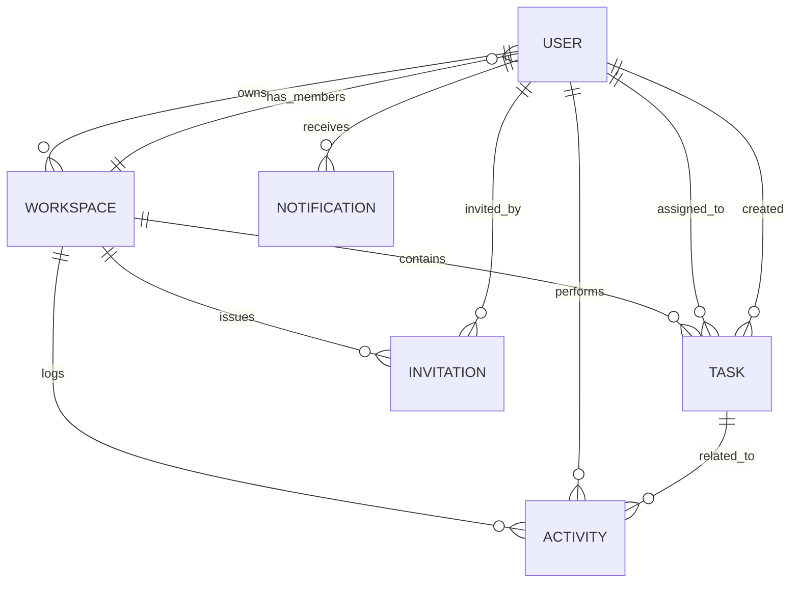

# Database ER Diagram

## Mermaid ER Diagram

## Relationship Explanation

- `USER ||--o{ WORKSPACE : owns`
  - Each workspace has one required owner user.
- `WORKSPACE ||--o{ USER : has_members`
  - Workspaces maintain a member list referencing multiple users.
- `WORKSPACE ||--o{ TASK : contains`
  - Tasks are assigned to a single workspace.
- `USER ||--o{ TASK : assigned_to`
  - Tasks may have an assignee user reference.
- `USER ||--o{ TASK : created`
  - Tasks track the creating user in `createdBy`.
- `WORKSPACE ||--o{ INVITATION : issues`
  - Invitations belong to a workspace.
- `USER ||--o{ INVITATION : invited_by`
  - Invitations record the inviting user.
- `USER ||--o{ NOTIFICATION : receives`
  - Notifications belong to a target user.
- `WORKSPACE ||--o{ ACTIVITY : logs`
  - Activity entries belong to a workspace.
- `USER ||--o{ ACTIVITY : performs`
  - Activity entries reference the acting user.
- `TASK ||--o{ ACTIVITY : related_to`
  - Activity entries optionally relate to a task.

> Note: `Task` embeds `attachments` and `comments` as arrays of subdocuments, not as separate collections.
